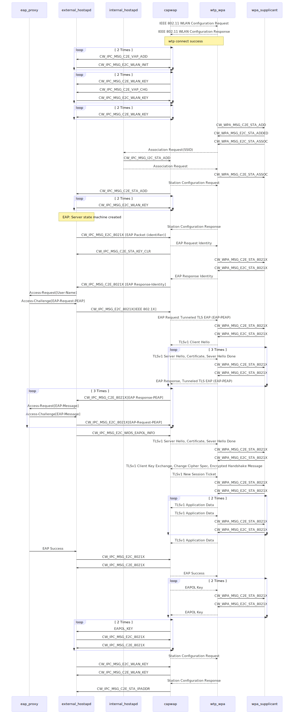

#node-capwap

### CAPWAP implementation in JavaScript (Work in progress)

Control And Provisioning of Wireless Access Points (CAPWAP) Protocol implementation for Node.js
written in JavaScript.

### Objectives

### Running

Install Dependent using NPM.

```
npm install
```

Modify config.json.

```
{
	"server_ip": "172.16.94.161",
	"client_ip": "172.16.94.163"
}
```

Start

```
Server: node server.js  
Client: node client.js  
```

### Mermaid

[Mermaid](http://knsv.github.io/mermaid/) doc for modules interaction

```
sequenceDiagram
    participant apserver
    participant wtp_wpa
    participant wpa_supplicant

    apserver-->>wtp_wpa: IEEE 802.11 WLAN Configuration Request
    wtp_wpa-->>apserver: IEEE 802.11 WLAN Configuration Response
    
    Note over apserver,wtp_wpa: wtp connect success
    
    wtp_wpa->>wpa_supplicant: CW_WPA_MSG_C2E_STA_ADD
    wpa_supplicant->>wtp_wpa: CW_WPA_MSG_E2C_STA_ADDED
    wpa_supplicant->>wtp_wpa: CW_WPA_MSG_E2C_STA_ASSOC
    wtp_wpa-->>apserver: Association Request(SSID)
    apserver-->>wtp_wpa: Association Request
    wtp_wpa->>wpa_supplicant: CW_WPA_MSG_C2E_STA_ASSOC

    apserver-->>wtp_wpa: Station Configuration Request
    wtp_wpa-->>apserver: Station Configuration Response
    apserver-->>wtp_wpa: EAP Request Identity

```

Generated diagram




### Todo List

 * check if ip/port used by other wtp-session
 * find wtp hash by sn
 * udpate wtp hash ip and port
 * add ip port hash entry
 * check account sta 
 * if wtp session already start, shutdown it
 * after configuration update cloud need start json file push and 802.11 wlan configuration;

### Change Log

Changes for each release.

#### Version 0.0.1

Thu Oct 1 09:00:00 UTC 2015

 * CAPWAP control channel protocol realization, support basic message type for ap connect
 * use [fschaefer/Stately.js](https://github.com/fschaefer/Stately.js) as DSL state machine
 * replace console.log with [visionmedia/debug](https://github.com/visionmedia/debug)

#### Version 0.0.2

Thu Nov 4 09:00:00 UTC 2015

 * Add wtp-hash, account-context, wtp-session to manage protocol interaction  
 * Add config file,  


# License

Copyright (c) 2015 Zhaoqing Qiang. Under The MIT License (MIT)
