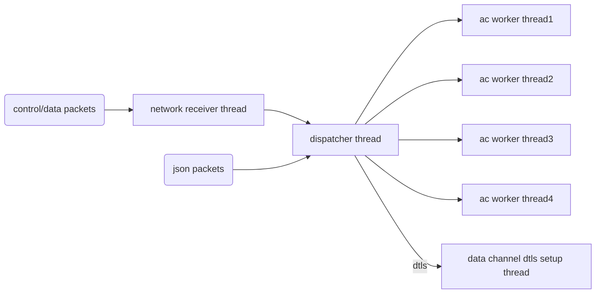

# APServer

## Table

## Content

### Components

#### Introduction

capwap:  
hostapd:  
eap_proxy:  
aplogger:  
timezone:  
aptracer:

#### capwap

##### network receiver thread

receive packets from control channel or data channel.  
control packet is from port 5246 and data packet is from port 5247.  
we use share memory packet list to handle the receiver and dispatcher process.  
when receive packet network receiver commit packet into packet list.

##### dispatcher thread

dispatcher thread get packet from share memory packet list.  
move that packet to ac worker thread packet queue.  
dispatcher also setup json socket and receive json packet from network.  
json packets are from portal which are always used for configuration.  
move dtls data packets to dtls packet queue.

##### ac worker thread

we have multi worker thread which can config in the configuration file.  
each worker thread process packet from their packet queue.

##### data channel dtls setup thread

get dtls packet from dtls packet queue.

