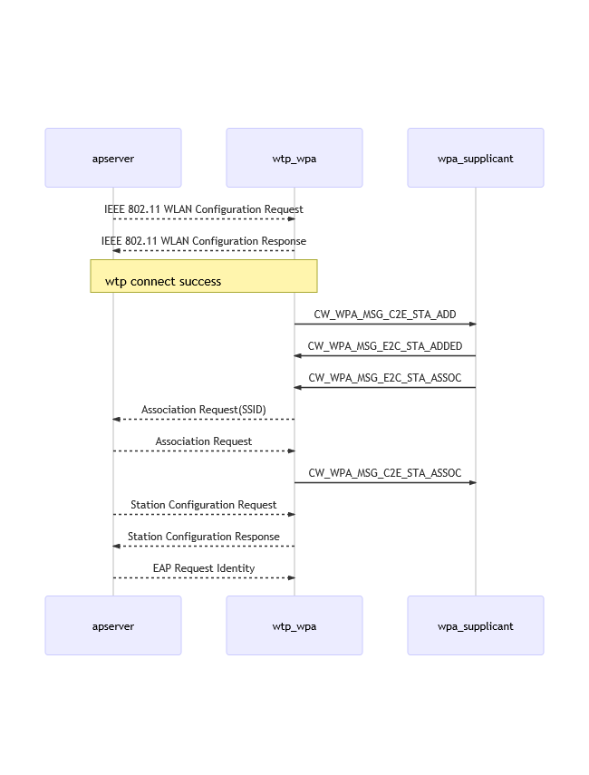

#diagram

### Mermaid

[Mermaid](http://knsv.github.io/mermaid/) doc for modules interaction

```
sequenceDiagram
    participant apserver
    participant wtp_wpa
    participant wpa_supplicant

    apserver-->>wtp_wpa: IEEE 802.11 WLAN Configuration Request
    wtp_wpa-->>apserver: IEEE 802.11 WLAN Configuration Response
    
    Note over apserver,wtp_wpa: wtp connect success
    
    wtp_wpa->>wpa_supplicant: CW_WPA_MSG_C2E_STA_ADD
    wpa_supplicant->>wtp_wpa: CW_WPA_MSG_E2C_STA_ADDED
    wpa_supplicant->>wtp_wpa: CW_WPA_MSG_E2C_STA_ASSOC
    wtp_wpa-->>apserver: Association Request(SSID)
    apserver-->>wtp_wpa: Association Request
    wtp_wpa->>wpa_supplicant: CW_WPA_MSG_C2E_STA_ASSOC

    apserver-->>wtp_wpa: Station Configuration Request
    wtp_wpa-->>apserver: Station Configuration Response
    apserver-->>wtp_wpa: EAP Request Identity
    wtp_wpa->>wpa_supplicant: CW_WPA_MSG_C2E_STA_8021X
    wpa_supplicant->>wtp_wpa: CW_WPA_MSG_E2C_STA_8021X

    wtp_wpa-->>apserver: EAP Response Identity
    apserver-->>wtp_wpa: EAP Request Tunneled TLS EAP (EAP-TTLS)

    wtp_wpa->>wpa_supplicant: CW_WPA_MSG_C2E_STA_8021X
    wpa_supplicant->>wtp_wpa: CW_WPA_MSG_E2C_STA_8021X

    wtp_wpa-->>apserver: TLSv1 Client Hello

    loop 3 Times
        apserver-->>wtp_wpa: TLSv1 Server Hello, Certificate, Sever Hello Done
        
        wtp_wpa->>wpa_supplicant: CW_WPA_MSG_C2E_STA_8021X
        wpa_supplicant->>wtp_wpa: CW_WPA_MSG_E2C_STA_8021X

        wtp_wpa-->>apserver: EAP Response, Tunneled TLS EAP (EAP-TTLS)
    end

    apserver-->>wtp_wpa: TLSv1 Server Hello, Certificate, Sever Hello Done
    
    wtp_wpa->>wpa_supplicant: CW_WPA_MSG_C2E_STA_8021X
    wpa_supplicant->>wtp_wpa: CW_WPA_MSG_E2C_STA_8021X

    wtp_wpa-->>apserver: TLSv1 Client Key Exchange, Change Cipher Spec, Encrypted Handshake Message
    apserver-->>wtp_wpa: TLSv1 New Session Ticket

    wtp_wpa->>wpa_supplicant: CW_WPA_MSG_C2E_STA_8021X
    wpa_supplicant->>wtp_wpa: CW_WPA_MSG_E2C_STA_8021X

    loop 2 Times
        wtp_wpa-->>apserver: TLSv1 Application Data
        apserver-->>wtp_wpa: TLSv1 Application Data

        wtp_wpa->>wpa_supplicant: CW_WPA_MSG_C2E_STA_8021X
        wpa_supplicant->>wtp_wpa: CW_WPA_MSG_E2C_STA_8021X
    end

    wtp_wpa-->>apserver: TLSv1 Application Data
    apserver-->>wtp_wpa: EAP Success

    loop 2 Times
        apserver-->>wtp_wpa: EAPOL Key
        wtp_wpa->>wpa_supplicant: CW_WPA_MSG_C2E_STA_8021X
	    wpa_supplicant->>wtp_wpa: CW_WPA_MSG_E2C_STA_8021X
	    wtp_wpa-->>apserver: EAPOL Key
    end

    apserver-->>wtp_wpa: Station Configuration Request
    wtp_wpa-->>apserver: Station Configuration Response

```

Generated diagram


