## FAQ

#### Q: AP Discovery: high level description of what happens here and how we process, and which programs/functions are involved?

capwap daemon(dispatcher thread) validates sending AP’s serial number to see if the AP has been added (deployed) by customer to his AP network


```c
dispatcher_thread -> dispatcher_process_incoming_packets -> cwAcProcDiscoverReqMsg
```

1. dispatcher thread receive discovery req control packet from 5246 port
1. Discovery Req packet should take wtp board data element with serial number
1. Check if ap SN already in wtp sn hash table.  
   (when user add ap to apnetwork portal will insert sn into apportal.ap_ap table and apserver load it when startup [DB Load](#db-load))
   - not configed: no response
1. update ap port and ip in wtp hash. (wtp is the alias of ap in code and protocol)
1. build Discovery Response message elements
1. send response message by cwSendCtlSockMsg

#### Q: AP Join: high level description of what happens here and how we process, and which programs/functions are involved

capwap worker thread validate the req message, udpate memory context, update database and build response

```c
dispatcher_thread -> dispatcher_process_incoming_packets -> packet_list_add ==> worker->pkts_queue

cwAcThreadMain -> cwAcThreadProcPacket -> cwAcThreadProcCtlPacket -> cwAcProcPlainCtlMsg -> cwAcProcJoinReq ==> emit CWAE_JOIN_REQ_RECV event

cwAcThreadMain -> cwAcFsmThread -> cwAcFsm_advance -> CWAS_JOIN_enter
```

1. dispatcher thread dispatch the join request message to worker pkts queue
1. worker thread main loop get join request message from pkts queue and emit CWAE_JOIN_REQ_RECV event
1. worker thread state machine call CWAS_JOIN_enter to handle join req message
1. do some element checking including: sn, admin status, session id, dfs cap
1. update wtp session context, firmware upgrade result, database utm version
1. build join response message, send by CW_AC_SEND_CTL_MSG, start timer CWTMR_WAIT_JOIN and waiting AP Configuration Status Request message

#### Q: AP Firmware Download: please mention flow/sequence such as AP -> CAPWAP, AP -> FMServer -> DB, etc (which programs/functions are involved and the flow like how AP request the image until how the same reaches the AP)

firmware download involve APPortal, APServer, FirmwareServer and AP

1. User schedule AP firmware download task on GUI

   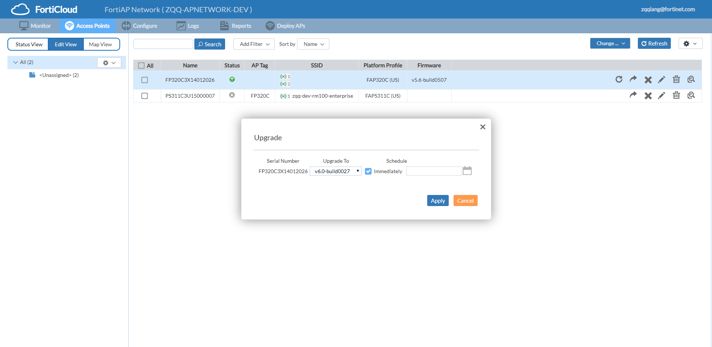

1. APPortal send json "/wlan/image/" to APServer

   ```json
   {
     "id": 2851,
     "url": "/wlan/image/",
     "method": "put",
     "apNetworkOid": 1094,
     "params": [
       {
         "sn": "FP320C3X14012026",
         "fwVersion": "FP320C-v6.0-build0027",
         "schedule-time": 1545261110,
         "imageIdentifier": "06000000FIMG0501000003"
       }
     ]
   }
   ```

1. wlan_image_handler process the json cmd match url /wlan/iamge
1. wlan_image_upgrade schedule a firmware upgrade task
1. schedule_firmware_upgrade add new task to scheduler->schedule_list
1. firmware_upgrade_scheduler_run check download task expiration, status and move task to scheduler->run_list
1. firmware_upgrade_scheduler_run send WTP_FIRMWARE_STATUS_UPDATE and IMAGE_UPGRADE cmd to async task thread
1. async task thread receive IMAGE_UPGRADE cmd and call exec_image_upgrade_task
1. db_get_image_file get firmware image from signaturedb.ap_firmware table and write it in APServer local file system
1. if APServer already download the firmware image before no need to do it again
1. send_fcld_firmware_download_allow send below json cmd to FirmwareServer

   ```json
   {
     "url": "/FirmwareServer/image/allow/",
     "method": "put",
     "params": [
       {
         "sn": "FP320C3X14012026",
         "firmware": "FP320C-v6.0-build0027"
       }
     ]
   }
   ```

1. FirmwareServer will allow that AP with same SN download firmware directly
1. async task thread send CW_IPC_MSG_CMF2C_IMAGE_PUSH cmd to capwap worker thread
1. cwIpcImagePush call cwAcSendCfgUpdReq_image to send Configuration Update Request message to AP

   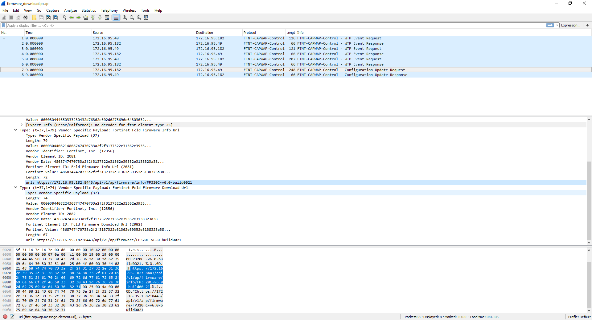

1. next step AP send below HTTPS request to FirmwareServer to download firmware and get firmware info

   ```
   GET /api/v1/ap/firmware/FP320C-v6.0-build0027 HTTP/1.1
   GET /api/v1/ap/firmware/info/FP320C-v6.0-build0027 HTTP/1.1
   ```

#### Q: AP Config Download: please mention flow (programs and database) for one example such as an user creating an SSID in AP Portal (available for all his APs) ; i.e., where AP Portal stores the SSID config, how CAPWAP program reads it and sends it to all involved APs ; in capwap module , please try to mention names of functions/threads involved in the flow ; please start the flow from user (GUI) and how config lands in AP

1. user create one SSID on GUI like below

   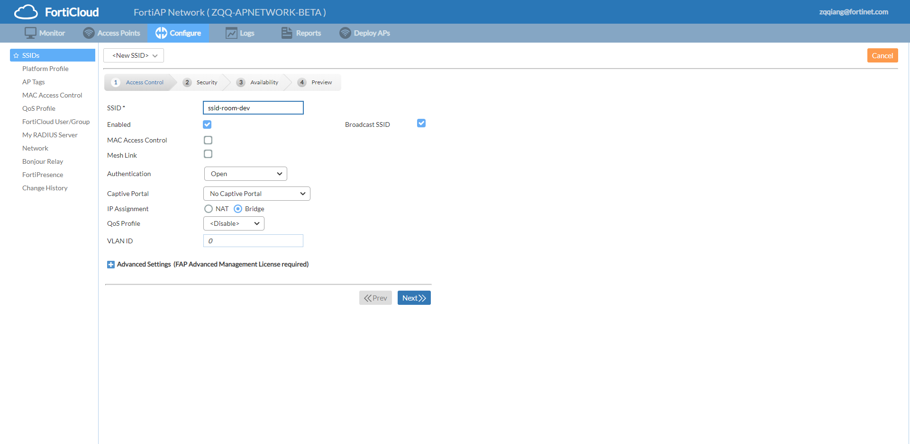

   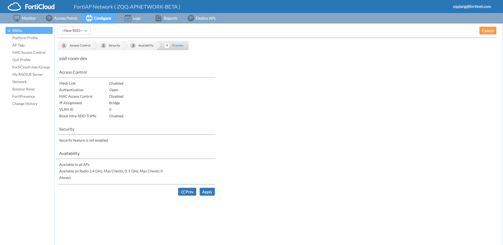

1. APPortal save configuration to database apportal.ap_ssid
1. APPortal also send json cmd to APServer

   ```json
   {
     "id": 2876,
     "url": "/wlan/vap/",
     "method": "put",
     "apNetworkOid": 1094,
     "params": [
       {
         "applicationEnabled": "disable",
         "apply-all": "enable",
         "auth": "radius",
         "avEnabled": "disable",
         "band24MaxClients": 0,
         "band50MaxClients": 0,
         "bandAvailability": 3,
         "botnetEnabled": "disable",
         "broadcast-ssid": "enable",
         "captive-category": "clickThrough",
         "captivePortal": "none",
         "captiveRedirect": 0,
         "captiveRedirectURL": "",
         "dataRates": "",
         "encrypt": "AES",
         "intraPrivacy": 0,
         "ipsEnabled": "disable",
         "lanIsolation": 0,
         "macAuth": "0",
         "macAuthFailThroughMode": 0,
         "meshBackhaul": 0,
         "nat": 0,
         "natIp": "0.0.0.0",
         "natIpLeaseTime": 3600,
         "natMask": "0.0.0.0",
         "oid": 2198,
         "schedule": 0,
         "scheduleTime": "",
         "security": "open",
         "splashUrl": "",
         "ssid": "dev-room-ssid",
         "status": "enable",
         "walled-gardent-address": "",
         "webAccess": 0
       }
     ]
   }
   ```

1. url /wlan/vap/ and method put match wlan_vap_add function
1. cwAcAddVap -> cwAcWlanRbtChg start the SSID configuration process
1. check if account_ctx->cw_wl_tree already has this SSID
   - if exist: do update process
   - if no: cwAcWlanRbtAdd do wlan create process
1. cwAcWlanRbtAdd create new cwWlanInfo_t struct, update it with json put params and insert into account_ctx->cw_wl_tree
1. cwAcTagReferenceChange start the tag bitset process, tag is used to associate the SSID with AP
1. for each AP has same tag with SSID call cwAcWtpRadioTagChange
1. cwAcWtpRadioTagChange -> cwAcWtpAddWlan add SSID for matched wtp
1. cwAcSetupVap will check if hostapd is involved
   - yes: send CW_IPC_MSG_C2E_VAP_ADD cmd to hostapd
   - no: cwAcSendLanCfgReq_add send CW_CTL_MSG_TYPE_80211_WLAN_CFG_REQ message to AP
1. cwAcSendCfgUpdReq_vap_mpsk send Configuration Update Req to AP to update mpsk config if need
1. cwAcSendWlCfgReqVapDownupSchedule send Configuration Update Req to AP to update downup schedule config if need
1. cwAcSendCfgUpdReq_vap_downup send Configuration Update Req to AP to downup the SSID if need
1. cwAcSendCfgUpdReq_vap_me_walled_garden send Configuration Update Req to AP to push the walled garden config if need

#### Q: AP Config Changes: please mention flow when for example an AP’s LED is turned on or off, LED blinking, an AP radio’s transmit power is changed, etc; please start the flow from user (GUI) and how changed config lands in AP

##### LED truned on or off

1. user checked Led Off checkbox on platform form

   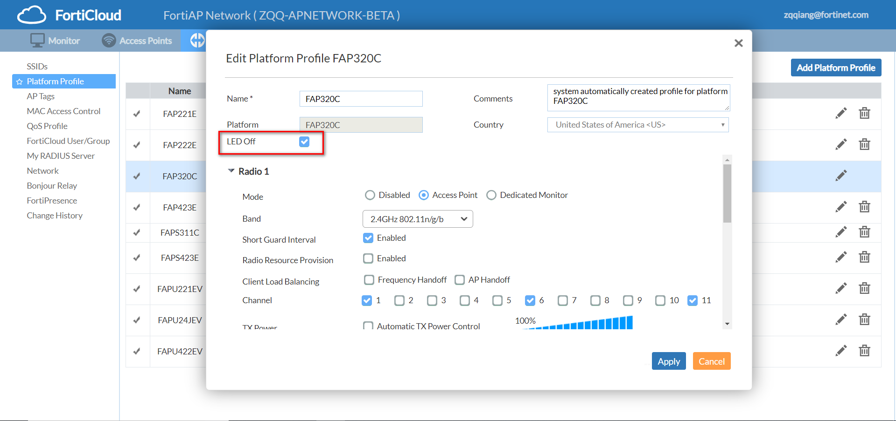

1. APPortal send json cmd to APServer which ledOff params is 0

   ```json
   {
     "id": 2903,
     "url": "/wlan/wtpprof/",
     "method": "put",
     "apNetworkOid": 1094,
     "params": [
       {
         "platform": "FAP320C",
         "countryCode": "US",
         "maxClients": 0,
         "ledOff": 0,
         "oid": 1229,
         "name": "FAP320C",
         "radios": [
           {
             "mode": "ap",
             "spectrumAnalysis": "disable",
             "radioProvision": "disable",
             "radio-scan": "disable",
             "loadBalancing": "",
             "band": "2.4GHz 802.11n/g/b",
             "shortGuardInterval": "enable",
             "channel": "1,6,11",
             "txPowerAuto": "disable",
             "powerLevel": 100,
             "oid": 2157,
             "radio_id": 1
           },
           {
             "mode": "ap",
             "spectrumAnalysis": "disable",
             "radioProvision": "disable",
             "radio-scan": "disable",
             "loadBalancing": "",
             "band": "5GHz 802.11ac/n/a",
             "channelWidth": "20MHz",
             "shortGuardInterval": "enable",
             "channel": "36,40,44,48,52,56,60,64,100,104,108,112,116,132,136,140,149,153,157,161,165",
             "txPowerAuto": "disable",
             "powerLevel": 100,
             "oid": 2158,
             "radio_id": 2
           }
         ]
       }
     ]
   }
   ```

1. wlan_wtpprof_add update wtpprof->led_dark by json ledOff attr
1. cwAcAddWtpProf -> cwAcWtpprofRbtChg (todo)

##### LED blinking

1. user click the LED blinking link on GUI
   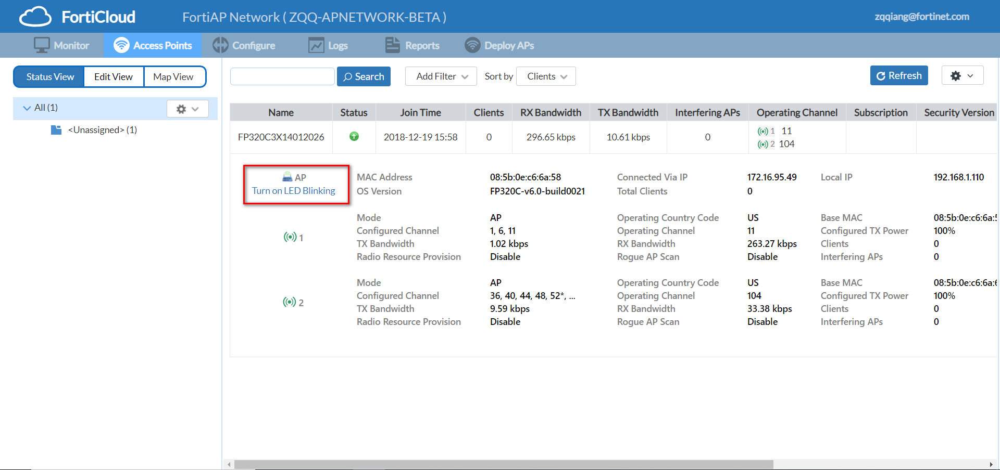
1. APPortal send json cmd which led_blink is 1 and led_blink_duration is 120s to APServer
   ```json
   {
     "id": 2921,
     "url": "/wlan/wtp/",
     "method": "put",
     "apNetworkOid": 1094,
     "params": [
       {
         "oid": 5491,
         "sn": "FP320C3X14012026",
         "name": "FP320C3X14012026",
         "admin-password": "I79LS/CrUklNpTV1PGImsA==",
         "allowaccess": ["telnet", "http", "https", "ssh"],
         "admin": "enable",
         "apProfileOid": 1229,
         "led_blink": 1,
         "led_blink_duration": 120,
         "tag-oids": []
       }
     ]
   }
   ```
1. cwAcWtpRbtChg send the Configuration Update Request with led blink and led blink duration

   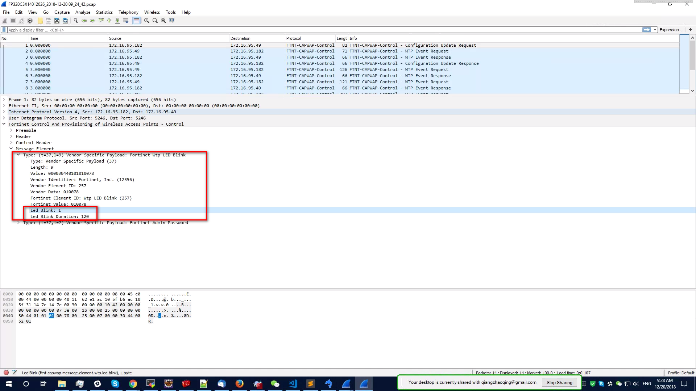

##### AP radio’s transmit power change

todo

#### Q: Client Connection - Probing: Are Probe Request / Probe Response processing handled locally in AP or are they forwarded to controller? If forwarded to controller, please mention the flow with CAPWAP protocol message types used.

Probe Request / Probe Response processing handled locally in AP, APServer doesn't involve in the probe process

#### Q: Client Connection – Authentication and Association: Are Authentication / Association Request / Association Response processing handled locally in AP or are they forwarded to controller? If forwarded to controller, please mention the flow with CAPWAP protocol message types used.

##### Association

Association Request/Response will forward to APServer

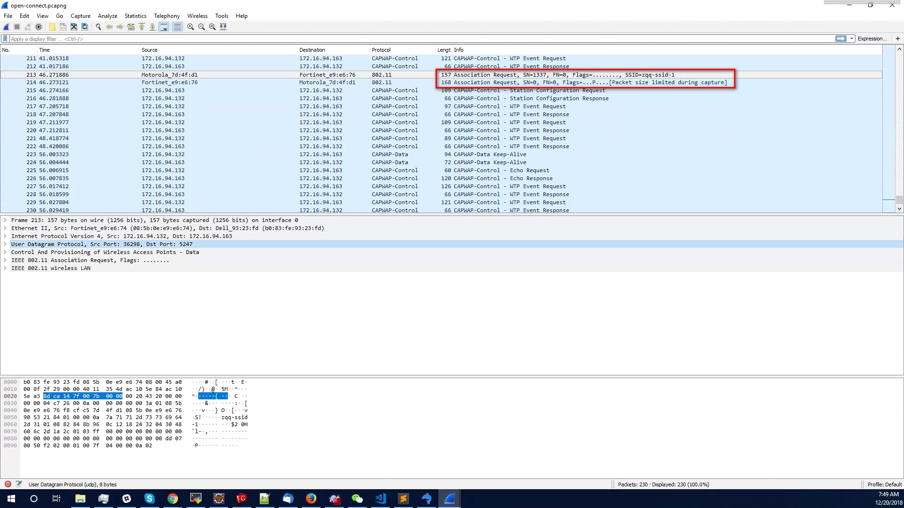

1. association message is received from port 5247 which is capwap data channel
1. RFC5416 defined the capwap data message bindings
1. The CAPWAP protocol defines the CAPWAP data message, which is used to encapsulate a wireless payload. For
   IEEE 802.11, the IEEE 802.11 header and payload are encapsulated
   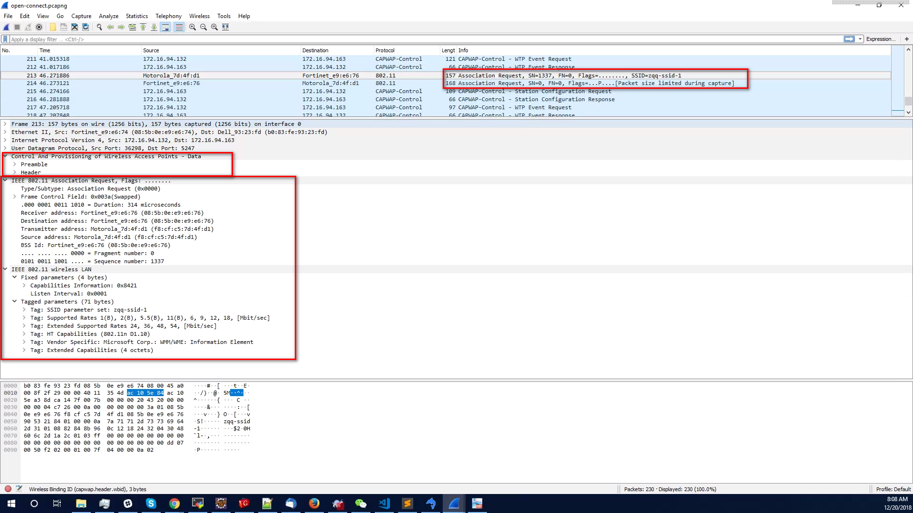
1. dispatcher forward the asso req to worker thread
1. cwAcDataCwRecv is the start entry of asso req message process
   ```c
   cwAcDataCwRecv -> cwAcDataWifiMgmtAndUnknownSta -> cw_hapd_80211_input ->
   ieee802_11_mgmt -> handle_assoc -> send_assoc_resp
   ```
1. handle_assoc: before send asso resp to sta it send CW_IPC_MSG_I2C_STA_ADD worker itself
1. cwIpsMsgI2cStaAdd alloc sta context and link it to all reference context
1. finally send Station Configuration Request to AP with Add Station message element

#### Q: Client Authentication (11i) – PSK (Personal): Is this handled locally at AP or at controller? If at controller, please mention the flow with CAPWAP protocol message types used. Please mention flow like AP -> CAPWAP program -> …

AP support local standalone mode so wpa2-personal security mode is handled locally at AP

#### Q: Client Authentication (11i) – 802.1X (Enterprise): please mention the flow with CAPWAP protocol message types used. AP -> EAP_PROXY program -> …

let's take 802.1x enterprise user group as an example. See below capwap pkt capture  
this parts of code is mainly from the open source wpa_supplicant, it's rarely has opportunity to change it  
so we have low priority to go through it and talk details later  
this part will touch eap_proxy and hostapd together

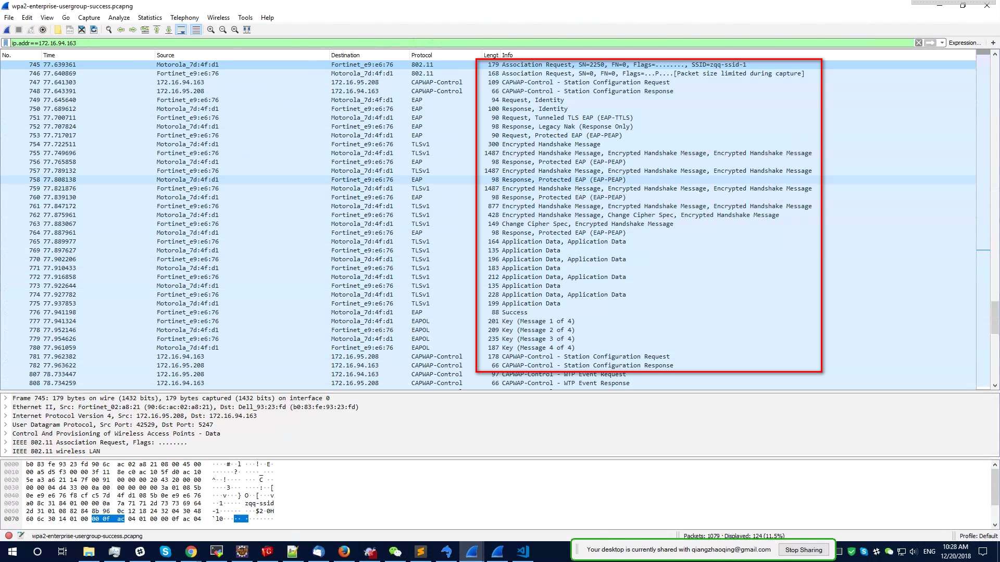

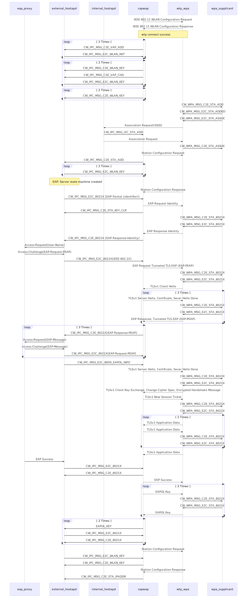

#### Q: Client Data Transfer - data frames (encrypted or open): I assume AP does not forward data frames to controller. Please clarify.

Yes, client data is not forward to controller

#### Q: Client Disconnection – De-authentication and Disassociation: please mention where these are processed and the flow.

1. similar to assocation flow disassociation is start from ieee802_11_mgmt function

   ```c
   ieee802_11_mgmt -> handle_disassoc
   ```

1. it will send CW_IPC_MSG_I2C_STA_DEL message to worker
1. worker thread cwIpcMsgI2cStaDel function clear context
1. and send Station Configuration Request with Delete Station message element

#### Q: Periodically Collecting Client Statistics: please mention flow for how AP sends stats such as its clients count, throughput of each client, RSSI of each client, etc. do these go to CAPWAP or APLOGGER, and which database/table. Please try to mention program names and funtions/threads for receiving these statistics. I assume these are WTP Event Requests, please clarify

##### current stats

1. AP clients count: it's calculate by capwap when sta is connected capwap create sta context. When APPortal query the client total info by json cmd cwAcGetClientTotal will do that calculation

   ```json
   {
     "id": 2966,
     "url": "/wlan/wtp/topClient/",
     "method": "get",
     "apNetworkOid": 1094,
     "params": [
       {
         "top": 20,
         "sortByClient": 1,
         "band5GHz": 1
       }
     ]
   }
   ```

1. throughput/RSSI: yes, AP report stats by WTP Event Request with sta stats list message element. cwAcUpd_stastatslist update stats into sta context so that when APPortal query by json cmd worker will calc stats from the sta context

##### history stats

1. user also has the requirement of history stats report so we have stats serialization
1. ap report client stats by wtp event request every 2 minutes (default interval)
1. todo

#### Q: Periodically Collecting AP Statistics: please mention flow for how AP sends its stats such as operating channel and transmit power, rogue aps detected, etc.

1. when user click Status View tab APPortal send json cmd to APServer to query wtp info

   ```json
   {
   "id": 3089,
   "url": "/wlan/wtp/",
   "method": "get",
   "apNetworkOid": 1094,
   "params": [
   	{
   	"oid": 5491,
   	"name": "FP320C3X14012026"
   	}
   ]
   }
   {
   "id": 3089,
   "result": [
   	{
   	"data": [
   		{
   		"serial": "FP320C3X14012026",
   		"ap_profile": 1229,
   		"connecting_from": "172.16.95.49",
   		"datachan_connecting_from": "172.16.95.49",
   		"state": "authorized",
   		"status": "connected",
   		"wtp_id": "FP320C3X14012026",
   		"region_code": "A ",
   		"name": "FP320C3X14012026",
   		"mgmt_vlanid": 0,
   		"is_trial": 1,
   		"led_blink": 0,
   		"led_blink_duration": 0,
   		"led_blink_remain": 0,
   		"data_chan_sec": "clear-text",
   		"last_reboot_time": 1545263893,
   		"reboot_last_day": false,
   		"clients": 0,
   		"os_version": "FP320C-v6.0-build0021",
   		"local_ipv4_addr": "192.168.1.110",
   		"board_mac": "08:5b:0e:c6:6a:58",
   		"join_time": 1545263932,
   		"connection_state": "Connected",
   		"image_download_progress": 0,
   		"radio": [
   			{
   			"radio_id": 1,
   			"mode": "AP",
   			"country_name": "US",
   			"country_code": 841,
   			"client_count": 0,
   			"base_bssid": "08:5b:0e:c6:6a:5a",
   			"max_vaps": 8,
   			"oper_chan": 11,
   			"txPowerAuto": "disable",
   			"powerLevel": 100,
   			"oper_txpower": 24,
   			"bandwidth_rx": 293782,
   			"bandwidth_tx": 0,
   			"bytes_rx": 3266398377,
   			"bytes_tx": 10803382,
   			"interfering_aps": 0,
   			"detect_interfering": false,
   			"mac_errors_rx": 1,
   			"mac_errors_tx": 1,
   			"radio_type": "2.4GHz 802.11n/g/b",
   			"beacon_interval": "100 ms",
   			"short_guard_interval": "enable",
   			"channel": "1, 6, 11",
   			"radio_resource_provision": "disable",
   			"rogue_ap_scan": "disable",
   			"ap_scan_passive": "disable",
   			"tags": []
   			},
   			{
   			"radio_id": 2,
   			"mode": "AP",
   			"country_name": "US",
   			"country_code": 841,
   			"client_count": 0,
   			"base_bssid": "08:5b:0e:c6:6a:62",
   			"max_vaps": 8,
   			"oper_chan": 116,
   			"txPowerAuto": "disable",
   			"powerLevel": 100,
   			"oper_txpower": 22,
   			"bandwidth_rx": 5666,
   			"bandwidth_tx": 7333,
   			"bytes_rx": 218492303,
   			"bytes_tx": 98221638,
   			"interfering_aps": 0,
   			"detect_interfering": false,
   			"mac_errors_rx": 0,
   			"mac_errors_tx": 0,
   			"radio_type": "5GHz 802.11ac/n/a",
   			"beacon_interval": "100 ms",
   			"short_guard_interval": "enable",
   			"channel": "36, 40, 44, 48, 52, 56, 60, 64, 100, 104, 108, 112, 116, 132, 136, 140, 149, 153, 157, 161, 165",
   			"radio_resource_provision": "disable",
   			"rogue_ap_scan": "disable",
   			"ap_scan_passive": "disable",
   			"tags": []
   			}
   		]
   		}
   	],
   	"code": 0,
   	"message": "ok"
   	}
   ]
   }
   ```

1. ap stats still from the wtp event request message
1. CWAS_RUN_enter function case CWAE_WTP_EVENT_REQ_RECV has all the meInfo process handler

#### Q: Client Roaming (Reassociation): please mention the flow and CAPWAP messages involved

1. similar to assocation flow reassociation is start from ieee802_11_mgmt function
1. match case WLAN_FC_STYPE_REASSOC_REQ and call handle_assoc
1. finally send association response to client

#### Q: Keep-Alive: Is there any keep-alive mechanism between AP and AC? If so, please tell whether it uses control or data channel. I assume it uses Echo Request / Echo Response packets, please confirm.

1. control channel use echo req/rsp to keep alive
1. data channel use keep-alive message with session id

#### Q:

## Others

### DB Load

APServer start will load related config from apportal database  
when APServer start cwAcCmfInit2 function will be called  
it iterate modules table to load all the moduels from database  
the database loading order is important we need load account first and then some others  
each load_xxx function define the related context init method and  
SQL which is good start to understand the database design

```c
main -> capwap_ac_main -> cwACInit -> cwAcCmfInit2 -> load_wtps_from_db -> cwAcAddWtpHashEntry -> add_wtp_sn_hash_entry
```

1. when capwap daemon start db load is part of the init process.
1. load wtps is part of the db load process.
1. SQL "SELECT ... p.sn ... from ap_ap AS p ..." is in load_wtps.
1. finally \_\_wtp_sn_head filled with all the related ap info.
1. other part of codes can use find_wtp_sn_hash_entry to check if ap already configed.

```c
// order is important, NOT change if you are not sure
static struct {
    int (* func)(char *user, char *password, char *host);
    const char *desc;
} modules[] = {
    {load_accounts_from_db, "load_accounts_from_db"},
    {load_tags, "load_tags"},
    {load_users_from_db, "load_users_from_db"},
    {load_groups_from_db, "load_groups_from_db"},
    {load_radius_from_db, "load_radius_from_db"},
    {load_utmprofiles, "load_utmprofiles"},
    {load_qos_from_db, "load_qos_from_db"},
    {load_wlans_from_db, "load_wlans_from_db"},
    {load_wtp_profs_from_db, "load_wtp_profs_from_db"},
    {load_wtps_from_db, "load_wtps_from_db"},
    {load_firmware_upgrade_task, "load_firmware_upgrade_task"},
    {load_vlan_sevices, "load_vlan_sevices"},
    {load_mac_auth_address, "load_mac_auth_address"},
    {NULL, ""}
};
```

#### Q: In DB Load, how the cache (in memory list of ap_ap table) gets updated when customer deploys a new AP through AP Portal (how the entry is read from ap_ap table into cache)

1. APServer only load database when startup
1. When user change configuration on GUI the apportal will send [json cmd](#json-cmd) to APServer capwap daemon

#### Q: AP Config Download: when AP reboots how does it get its config downloaded to begin with (ex: its platform profile, SSIDs to broadcast, MAC access control, associated QoS profile, etc)?

1. after join ap get some basic config from the Configuration Status Response message

   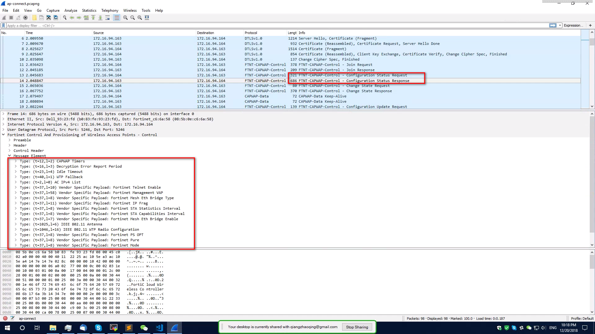

1. SSID is from the IEEE 802.11 WLAN Configuration Request
   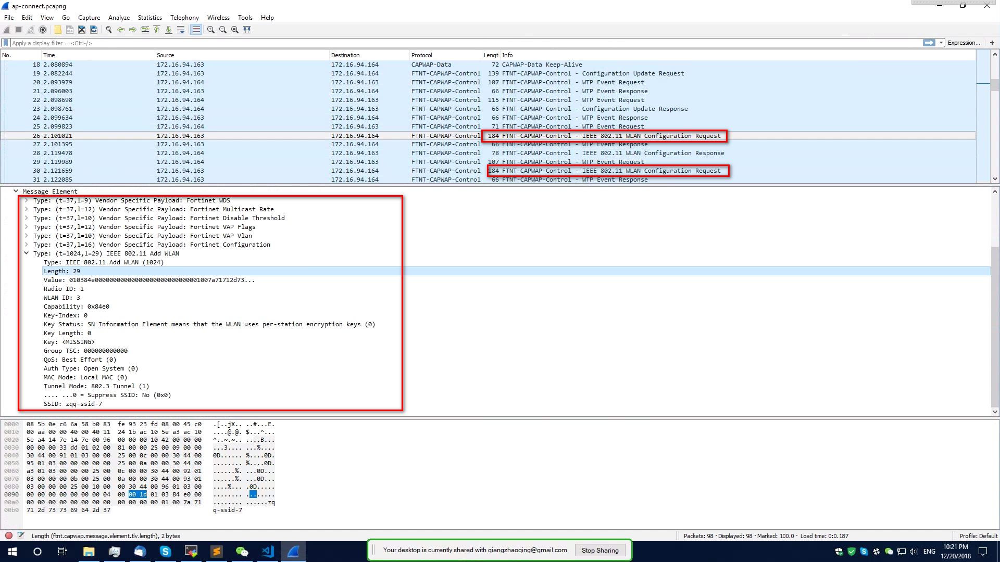

1. you can try to change some config and see which capwap control message is push to ap and when ap join the same message used
1. all other configs push by its related capwap messages, so ap config download is part of the protocol covered by RFC5415

### JSON Cmd

```c
fcldd_handler_t fcldd_handler [] = {
    {"/wlan/apNetwork/", wlan_apnetwork_handler, JSON_METHOD_ROUTING_GLOBA},
	...
};
```

fcldd_handler defined all the json cmd handler entry  
grep the json cmd from the /var/log/capwap.log and search the url in fcldd_handler  
then you can get the entry of that configuration

### Data channel dtls setup thead

when first data channel keep alive message is coming dispatcher can't know which ap is from
data channel keepalive message is from diff port but the keepalive contain the session id which should be same with join req

```c
datachan_dtls_setup_thread -> datadtls_process_packets
```

1. dispatcher thread receive encrypted keep alive message and put it in datadtls.dtls_pkts_queue
1. data channel dtls thread create socket pair cipher and plain
1. data channel dtls thread read pkts from datadtls.dtls_pkts_queue and write to cipher socket
1. cWtpSessionThreadData_tmpDtlsCtx -> acWtpSessionThread_data will SSL_read to get the plain text packet
1. notify_dispatcher_keepalive_rcvd get session id from the keepalive message and send it to dispatcher
1. dipatcher call data_chan_keepalive_rcvd to send session id to worker thread
1. worker thread call cwAcDataChanFirstKeepAlive to handle first keepalive
1. emit CWAE_DATA_CHAN_CONNECTED event so the state machine can change according
1. update ws->dtls_ctx[CW_CHAN_TYPE_DATA] context and send keepalive response
1. finally apserver update the data channel port and ip hash so next data pkt can handle by its worker

#### Q: how session id is established (is it created afresh or do we use if it already exists). And, where all the session-id is used subsequently?

1. The Session ID message element value contains a randomly generated unsigned 128-bit integer.
1. CAPWAP Data Channel Keep-Alive, includes the Session Identifier message element, which is used to bind the control and data plane.
1. Data Channel Keep-Alive packet, with a Session ID message element matching that included by the WTP in the Join Request message.
1. Use of the Session Identifier message element enables the AC to match the control and data plane flows from multiple WTPs behind the same NAT system (multiple WTPs sharing the same IP address).
