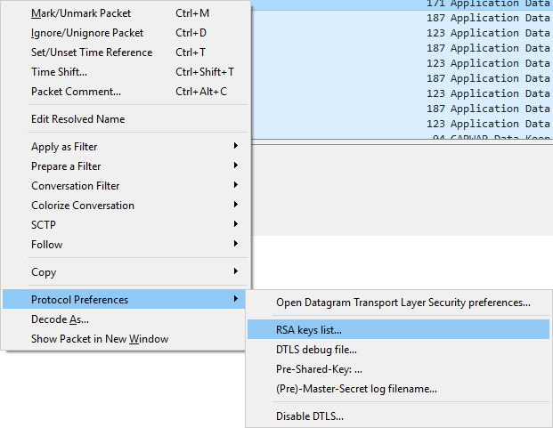
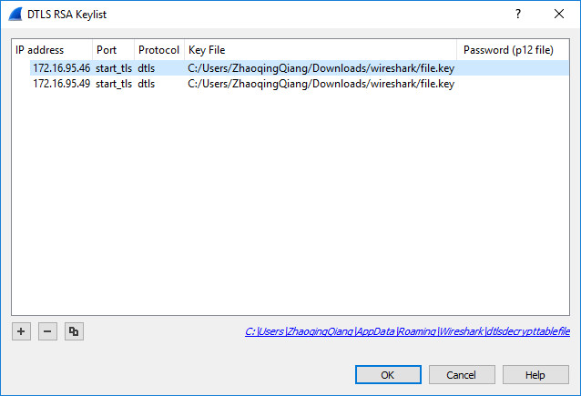
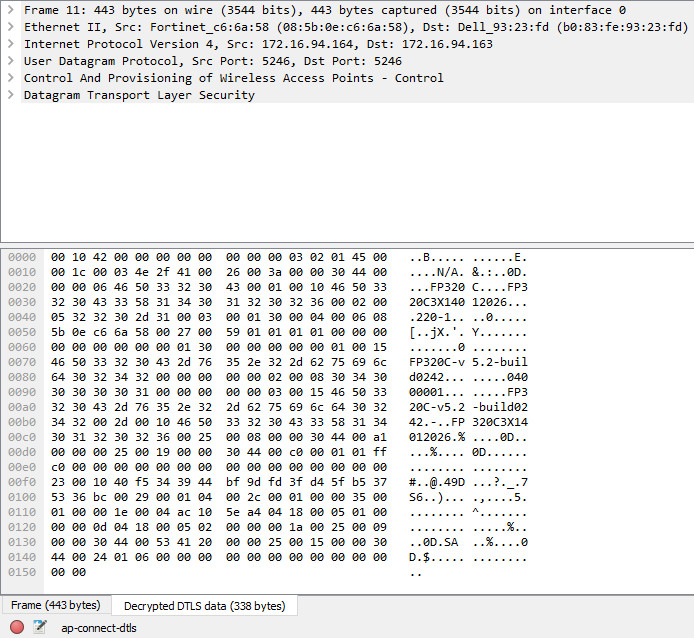
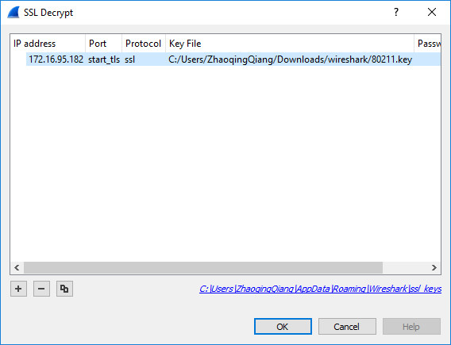
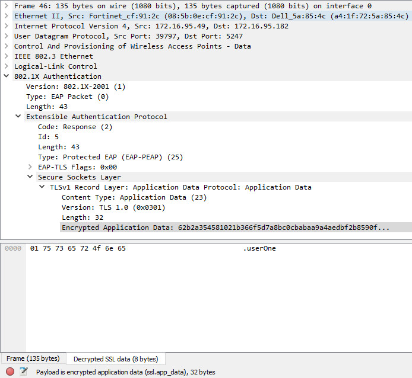

# How to decrypt ssl packet using wireshark

## DTLS
1. Right click dtls packet choose Protocol Preference. Then choose RSA Keylist.  

2. Press '+' button to add two row for server and client.  
    Format is IP Address, Port, Protocol, Key File  
    You need add server and client IP for two direction decryption.  
    The Key file is server private key.  

3. For capwap-control dtls packet you need /etc/cert/local/Fortinet_Local.key

4. Result.  

## TLS
1. Change protocol to ssl when config rsa keylist  

2. Private key file is /etc/cert/local/FortiCloud.key  
3. Result.  

